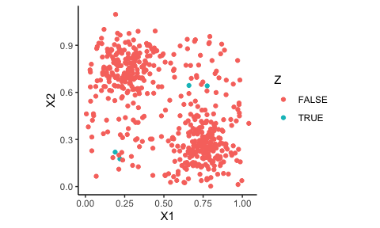

<!-- badges: start -->
<!-- badges: end -->

# Synthetic Caliper Matching (scmatch2)

This package implements the Synthetic Caliper Matching approach, which
is a blend of radius matching using distance metrics put on the
covariate distribution itself, and the synthetic control method. In
particular, it identifies sets of units local to each treated unit in
turn, and then makes a synthetic control for each treated unit using
those local units.

The GitHub repo also has replication materials for the associated paper
in the `scripts` directory; see below for further discussion of this
added-on code. The installed package will ignore `scripts`.

## Installation

You can install the development version of CSM from
[GitHub](https://github.com/) with:

    # install.packages("devtools")  # (if needed)
    devtools::install_github("jche/scmatch2")

# Quick demo of package

We generate a small toy dataset to illustrate the main methods of
interest:

``` r
set.seed( 4044440 )
dat <- gen_one_toy(nt = 5)
dat
#> # A tibble: 503 × 8
#>       id    X1     X2 Z      noise    Y0    Y1     Y
#>    <int> <dbl>  <dbl> <lgl>  <dbl> <dbl> <dbl> <dbl>
#>  1     1 0.189 0.219  TRUE   0.747  5.80  7.02  7.02
#>  2     2 0.220 0.176  TRUE   0.217  5.25  6.44  6.44
#>  3     3 0.776 0.641  TRUE   0.510  5.57  9.82  9.82
#>  4     4 0.660 0.644  TRUE   0.605  5.84  9.75  9.75
#>  5     5 0.778 0.244  FALSE -0.292  3.42  6.49  3.42
#>  6     6 0.702 0.0239 FALSE -0.462  2.49  4.67  2.49
#>  7     7 0.859 0.230  FALSE -0.226  3.00  6.27  3.00
#>  8     8 0.820 0.225  FALSE -0.125  3.28  6.42  3.28
#>  9     9 0.764 0.287  FALSE -0.380  3.61  6.77  3.61
#> 10    10 0.828 0.245  FALSE  0.663  4.13  7.35  4.13
#> # ℹ 493 more rows
ggplot( dat, aes( X1, X2, color = Z ) ) + geom_point() +
  coord_fixed()
```



To calculate matches, call `get_cal_matches()`–it will match, make
synthetic controls for each unit, and give you a final dataset back,
stored as an `csm_matches` object:

``` r
mtch <- get_cal_matches( dat, 
                        metric = "maximum",
                        scaling = c( 1/0.2, 1/0.2),
                        caliper = 1, 
                        rad_method = "adaptive", 
                        est_method = "scm" ) 
mtch
#> csm_matches: matching w/ maximum distance on 2, 3 
#> 4 Treated units matched to control units (1 above set caliper) 
#> Adaptive calipers: 1, 1.03315811247266, 1, 1 
#>  Target caliper = 1 
#>  Max distance ranges 0.924 - 1.033 
#> scaling: 5, 5
```

There are a variety of things you can pull from the result object. You
can get a list of statistics on the treated units:

``` r
mtch$treatment_table
#> # A tibble: 4 × 8
#>   id    subclass    nc   ess max_dist adacal feasible matched
#>   <chr> <chr>    <dbl> <dbl>    <dbl>  <dbl>    <dbl>   <dbl>
#> 1 1     1            3  1.76    0.991   1           1       1
#> 2 2     2            1  1       1.03    1.03        0       1
#> 3 3     3            9  1.99    0.924   1           1       1
#> 4 4     4            9  1.99    0.936   1           1       1
```

You can see all the units used, grouped by subclass:

``` r
full_unit_table(mtch, nonzero_weight_only = TRUE ) 
#> # A tibble: 13 × 12
#>    id        X1    X2 Z      noise    Y0    Y1     Y  dist subclass unit 
#>    <chr>  <dbl> <dbl> <lgl>  <dbl> <dbl> <dbl> <dbl> <dbl> <chr>    <chr>
#>  1 1     0.189  0.219 TRUE   0.747  5.80  7.02  7.02 0     1        tx1  
#>  2 501   0.113  0.413 FALSE -0.103  4.49  6.07  4.49 0.970 1        c1   
#>  3 503   0.0131 0.140 FALSE  0.233  4.94  5.40  4.94 0.882 1        c3   
#>  4 2     0.220  0.176 TRUE   0.217  5.25  6.44  6.44 0     2        tx1  
#>  5 503   0.0131 0.140 FALSE  0.233  4.94  5.40  4.94 1.03  2        c1   
#>  6 3     0.776  0.641 TRUE   0.510  5.57  9.82  9.82 0     3        tx1  
#>  7 31    0.772  0.597 FALSE -0.540  4.47  8.58  4.47 0.222 3        c1   
#>  8 210   0.886  0.520 FALSE  0.674  5.06  9.28  5.06 0.605 3        c4   
#>  9 481   0.609  0.826 FALSE -0.133  4.74  9.04  4.74 0.924 3        c8   
#> 10 4     0.660  0.644 TRUE   0.605  5.84  9.75  9.75 0     4        tx1  
#> 11 31    0.772  0.597 FALSE -0.540  4.47  8.58  4.47 0.562 4        c1   
#> 12 251   0.796  0.457 FALSE  0.684  5.24  9.00  5.24 0.936 4        c5   
#> 13 348   0.510  0.709 FALSE  0.289  5.31  8.96  5.31 0.750 4        c7   
#> # ℹ 1 more variable: weights <dbl>
```

You can get the final dataset (here filtering to only matches within the
initial caliper):

``` r
result_table( mtch, feasible_only = TRUE )
#> # A tibble: 6 × 9
#>   id    subclass Z         X1    X2    Y0    Y1     Y weights
#>   <chr> <chr>    <lgl>  <dbl> <dbl> <dbl> <dbl> <dbl>   <dbl>
#> 1 1_syn 1        FALSE 0.0817 0.327  4.63  5.86  4.63       1
#> 2 1     1        TRUE  0.189  0.219  5.80  7.02  7.02       1
#> 3 3_syn 3        FALSE 0.776  0.641  4.92  9.18  4.92       1
#> 4 3     3        TRUE  0.776  0.641  5.57  9.82  9.82       1
#> 5 4_syn 4        FALSE 0.660  0.644  4.83  8.74  4.83       1
#> 6 4     4        TRUE  0.660  0.644  5.84  9.75  9.75       1
```

You can also get the final generated result as a data.frame by casting
the result into a dataframe:

``` r
head( as.data.frame( mtch ) )
#> # A tibble: 6 × 9
#>   id    subclass Z         X1    X2    Y0    Y1     Y weights
#>   <chr> <chr>    <lgl>  <dbl> <dbl> <dbl> <dbl> <dbl>   <dbl>
#> 1 1_syn 1        FALSE 0.0817 0.327  4.63  5.86  4.63       1
#> 2 1     1        TRUE  0.189  0.219  5.80  7.02  7.02       1
#> 3 2_syn 2        FALSE 0.0131 0.140  4.94  5.40  4.94       1
#> 4 2     2        TRUE  0.220  0.176  5.25  6.44  6.44       1
#> 5 3_syn 3        FALSE 0.776  0.641  4.92  9.18  4.92       1
#> 6 3     3        TRUE  0.776  0.641  5.57  9.82  9.82       1
```

You can estimate impacts on the matched dataset using whatever tools you
want, or use the options discussed in our paper as so:

``` r
get_ATT_estimate( mtch )
#> # A tibble: 1 × 6
#>     ATE    SE sigma_hat   N_T N_C_tilde     t
#>   <dbl> <dbl>     <dbl> <int>     <dbl> <dbl>
#> 1  3.43 0.330     0.491     4      4.96  10.4
```

# Dependencies

This package has some tricky dependencies. In particular, it
(optionally) uses a DGP (for simulation) from ACIC 2016:

    remotes::install_github("vdorie/aciccomp/2016")

You should not need this package unless generating synthetic data.

# TO DO List

- Move the wrappers file to the scripts/simulation folder (it is
  utilities for simulation, not core package stuff)
- Keep boot_CSM (and the utility functions it uses), but move the other
  bootstrap stuff out of the main package.
- Make a separate folder for the inference simulation and it should have
  the annalysis file and the simulation file in it.

# Notes on scripts directory

In the scripts directory are several folders:

- analysis: This has the paper results. This makes plots and tables out
  of the simulation results.
- datagen: DGPs for demonstration. The simulation DGPs are in the
  sim_data.R file in the main package.
- demo: Illustrates use of the package.
- ferman-data-analysis: Empirical example in paper
- figs: Similar role as analysis, making figures out of existing results
- sims: Code that runs the various simulations in the paper

TODO: Reorg the directory structure a bit:

Thing we want:

- figs: Makes the illustration figures from the main paper, but nothing
  else. (No empirical or simulation results in this folder.)
- empirical: Does the empirical analysis (both Ferman data and LaLonde
  data analysis files)
- demo: Illustrates use of the package (only). Not anything included in
  the main paper.
- sims: The code to run the simulations
- sim_analysis: The code to analyze the simulation results
- sim_inference: The simulation and analysis code for the simulations
  evaluating inference.
- datagen: Move this folder to old code, unless it is used by something

TODO:Improve functions in aggregation.R
- agg_sc_units should not take X, Y, Z
- agg_co_units should not set things to NA?
